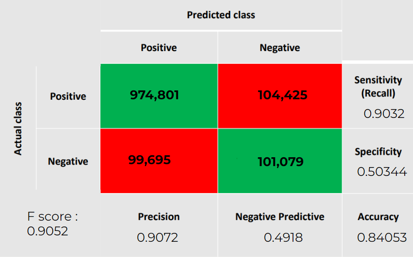

# Steam Game Sentiment Analysis using Naive Bayes Classifier

This repository contains a Python implementation of sentiment analysis using a Naive Bayes classifier. The classifier is trained on reviews of Steam games to predict whether a review is positive or negative.

## Dataset

The dataset used for training and testing the classifier consists of reviews of various Steam games. Each review is labeled as either positive or negative.

## Prerequisites

Make sure you have the following dependencies installed before running the code:

- Python (version 3.6 or higher)
- NumPy
- pandas

## Usage

Clone the repository:

   ```
   git clone https://github.com/wesam-hashmeh/steam-sentiment-analysis.git
   cd steam-sentiment-analysis
   ```


3. Prepare the dataset:

   - Download the Dataset from : https://www.kaggle.com/datasets/andrewmvd/steam-reviews
   - Place your dataset file in the `data` directory, following the required format (CSV).
   - Update the `data_path` variable in the `SteamSentAnalysis.py` file to point to your dataset file.

4. Preprocess the dataset:

   Run the following command to preprocess the dataset:

   ```
   python SteamSentAnalysis.py
   ```

   This script will perform necessary preprocessing steps such as cleaning the reviews, removing stop words, and splitting the dataset into training and testing sets. Train the Naive Bayes classifier and Test the classifier. This script will evaluate the performance of the trained classifier and display the accuracy and other relevant metrics.

## Results

After running the testing script, you will see the evaluation results, including the accuracy, precision, recall, and F1 score of the Naive Bayes classifier.

## Conclusion

This project demonstrates how to perform sentiment analysis on Steam game reviews using a Naive Bayes classifier. The trained classifier can be used to predict the sentiment (positive or negative) of new, unseen reviews. Feel free to modify and extend the code to suit your specific needs.

If you have any questions or suggestions, please feel free to open an issue or reach out to me.

Happy sentiment analysis!


### I included a demo that allows the user to input a sentence to predict if the review is positive or negative, currently tested at a 96% accuracy.

